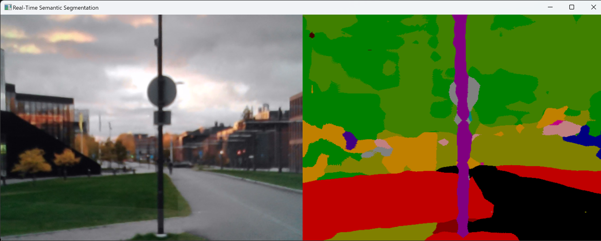
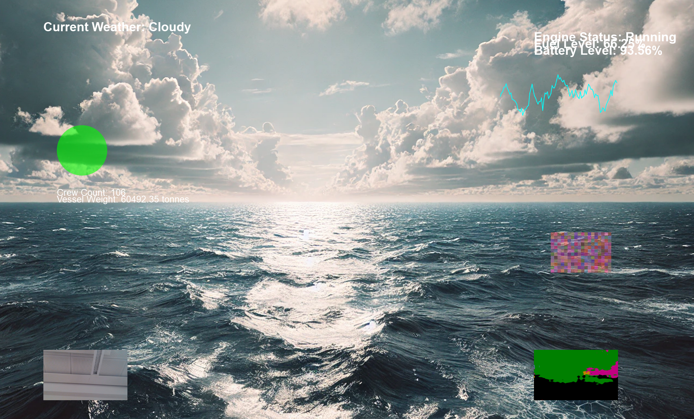

# GoogleCoral Examples with EdgeTPU

## 🌱 Overview

Welcome to the GoogleCoral examples repository! This repository contains scripts that utilize the Coral Edge TPU for real-time audio classification, semantic segmentation, and AR dashboards. The repository structure is as follows:

```
.
├── examples
│   ├── classifyspectrum_audio.py
│   ├── classify_audio.py
│   ├── real_time_audio_classification.py
│   ├── audio_yamnet_disp.py
│   ├── coral_segmentation_AR_pyqt_dashboard_transparent.py
│   ├── coral_segmentation_AR_pyqt_dashboard.py
│   └── semantic_seg.py
└── test_data
    ├── deeplab_mobilenet_edgetpu_slim_cityscapes_quant_edgetpu.tflite
    ├── miaow_16k.wav
    ├── speech_whistling2.wav
    ├── yamnet_class_map.csv
    └── yamnet_edgetpu.tflite
```

## 🧜‍♂️ Setup and Environment Creation

1. **Clone the repository**:

   ```bash
   git clone https://github.com/ajinkyagorad/GoogleCoral.git
   cd GoogleCoral
   ```

2. **Create and activate a conda environment**:

   ```bash
   conda create --name pycoral_env python=3.9
   conda activate pycoral_env
   ```

3. **Install dependencies**:

   ```bash
   pip install -r requirements.txt
   ```

4. **Coral USB Accelerator Setup**:
   Refer to the official Coral documentation for setting up your Coral USB Accelerator: [Coral Documentation](https://coral.ai/docs/accelerator/get-started/)

## 🔗 Scripts in This Repository

### 🔢 Semantic Segmentation: `semantic_seg.py`

This script uses the DeeplabV3 MobileNet model for performing semantic segmentation on an input image.

**Command to Run**:

```bash
python examples/semantic_seg.py --model test_data/deeplabv3_mnv2_pascal_quant_edgetpu.tflite
```

**Output**:
This will output a segmented version of the image highlighting distinct features such as roads, cars, etc.



### 🎧 Real-Time Audio Classification: `real_time_audio_classification.py`

This script uses YAMNet for real-time audio classification via Coral TPU. It can take live input from a microphone or classify from an audio file.

**Command to Run with Live Microphone**:

```bash
python examples/real_time_audio_classification.py --model test_data/yamnet_edgetpu.tflite --audio 0 --labels test_data/yamnet_class_map.csv
```

- **Input `--audio`**: The `--audio` parameter takes either the path to an audio file or `0` for live microphone input.
- `--audio 0`: Uses the first microphone channel as input for real-time classification.

**Output**:

- Displays the top 5 most probable sound classes detected in real-time, such as "Silence", "Speech", or "Dog Bark" with corresponding confidence levels.

**Command to Run with an Audio File**:

```bash
python examples/real_time_audio_classification.py --model test_data/yamnet_edgetpu.tflite --audio test_data/miaow_16k.wav --labels test_data/yamnet_class_map.csv
```

**Example Terminal Output**:

```
Time segment: 0.0 seconds
Class: Silence                  , Confidence: 0.668
Class: Inside, small room       , Confidence: 0.020
Class: Speech                   , Confidence: 0.016
Class: Whispering               , Confidence: 0.016
Class: Clicking                 , Confidence: 0.008
Inference time: 0.000 seconds
```

### 🎵 Real-Time Audio Visualization: `audio_yamnet_disp.py`

This script provides real-time audio classification while also showing an overlay visualization of the classification results. It can be used for visual monitoring of real-time sound classes.

**Command to Run with Computer Audio**:

```bash
python examples/audio_yamnet_disp.py --model test_data/yamnet_edgetpu.tflite --audio computer --labels test_data/yamnet_class_map.csv
```

- **Input `--audio computer`**: This option allows you to classify real-time audio from your computer's system output (e.g., "Stereo Mix").
  
- **Transparent Overlay**: The script uses a frameless and transparent window overlay to display the real-time classification, perfect for monitoring while using other applications.

**Command to Run with Microphone**:

```bash
python examples/audio_yamnet_disp.py --model test_data/yamnet_edgetpu.tflite --audio 0 --labels test_data/yamnet_class_map.csv
```

**Example Usage**:

- **System Audio Monitoring**: Use the `--audio computer` option to visualize the current system sound classes, which is useful during music playback or video conferencing.

### 🌈 AR Dashboard Viewer: `coral_segmentation_AR_pyqt_dashboard.py` & `coral_segmentation_AR_pyqt_dashboard_transparent.py`

These scripts provide an AR dashboard using Coral Edge TPU for real-time segmentation and a webcam feed. One version (`_transparent`) is designed for augmented reality with transparent areas, while the other version is intended for direct AR viewing.

#### Overview

The AR Dashboard Viewer code is a custom Python script designed for creating an Augmented Reality (AR) dashboard for AR glasses. Here's a brief overview of the main features:

- **AR Dashboard with Transparency**: 
  - The application window is frameless, stays on top, and has a fully transparent background. This allows the display to act as an overlay when used with AR glasses, where black areas become transparent.
  - It uses PyQt5 to create a UI that is visible but allows mouse events to pass through, giving it non-interactive behavior for the underlying application.

- **Edge TPU Integration**:
  - It integrates Google’s Edge TPU for semantic segmentation. The `make_interpreter` function initializes the model, and the segmentation output is processed and displayed as an overlay in the dashboard.
  - A real-time segmentation is performed using a webcam feed, making it suitable for applications like live object detection or environmental scanning.

- **Live Camera Feed and Visual Elements**:
  - The camera feed from a connected webcam is captured, processed, and displayed on the dashboard.
  - Several additional visual elements are drawn, including:
    - Weather conditions, engine status, crew information.
    - A radar chart displaying ship positions.
    - An "emotional topology map" and other abstract visualizations.
    - A line graph showing dynamically generated data.

- **Real-Time Updates**:
  - The dashboard refreshes periodically using a `QTimer` (`UPDATE_INTERVAL_MS = 100`), which updates the visuals and data to reflect changes in real time, simulating an immersive live dashboard.

- **Click-Through Interaction**:
  - On Windows, the `make_window_click_through` function is used to ensure that mouse input goes through the widget, making the UI non-intrusive and suitable for AR overlays.

- **Components and Layout**:
  - The visualizations are carefully arranged with margins to avoid clutter and provide clear AR information.
  - The drawing routines (`paintEvent`) use `QPainter` to handle graphics rendering efficiently.

**Command to Run Transparent AR Dashboard**:

```bash
python examples/coral_segmentation_AR_pyqt_dashboard_transparent.py
```

**Visual Representation**:



**Command to Run AR Dashboard with Opaque Background**:

```bash
python examples/coral_segmentation_AR_pyqt_dashboard.py
```

**Example Usage**:

- **AR Heads-Up Display (HUD)**: Use `coral_segmentation_AR_pyqt_dashboard_transparent.py` to create an AR overlay for glasses, which can be used for navigation aids, operational dashboards, or smart monitoring.

## 🚧 Troubleshooting & Common Errors

Below are some common issues you might face and how to solve them:

### 🚀 Dimension Mismatch Error

**Error**:

```
ValueError: Cannot set tensor: Dimension mismatch. Got 2 but expected 1 for input 0.
```

**Solution**:

- This error occurs due to incorrect tensor shape being fed into the model. Ensure that the input tensor has the correct shape by removing any unnecessary batch dimension.

### 📈 Python-CFFI Callback Error

**Error**:

```
Exception ignored from cffi callback <function _StreamBase...>
```

**Solution**:

- Ensure the correct sample rate is used (e.g., `16000 Hz`) and that input tensors match the expected dimensions for the YAMNet model.
- Verify that `sounddevice` is correctly installed and the callback method matches the data requirement.

## 🛠️ Dependencies

To install dependencies, use the `requirements.txt` file, which includes:

- `numpy`
- `soundfile`
- `sounddevice`
- `tflite_runtime`
- `matplotlib`
- `pycoral`

You can install them using:

```bash
pip install -r requirements.txt
```

## 🚀 Contributions

Feel free to open pull requests or issues if you'd like to add more examples or improve existing scripts. Contributions are always welcome!

## 👨‍💻 Author

Ajinkya Gorad - [GitHub](https://github.com/ajinkyagorad)

## 🛡 Known Issues

- **Real-Time Audio Latency**: There may be slight delays in real-time audio classification due to inference time. Optimizing the script for faster inference or using more powerful hardware can reduce latency.
- **Console Output Overwriting**: Current script logic replaces only the classification output but keeps a running history above. This behavior ensures visibility of older classification outputs.

Happy coding! 🚀🌟
